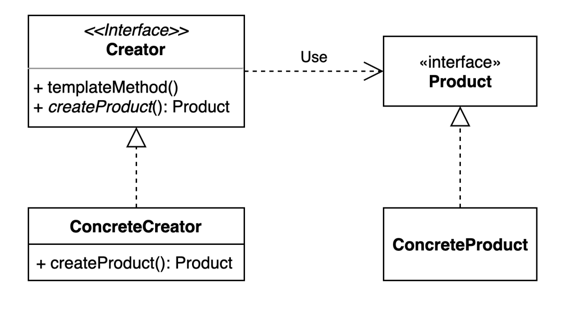
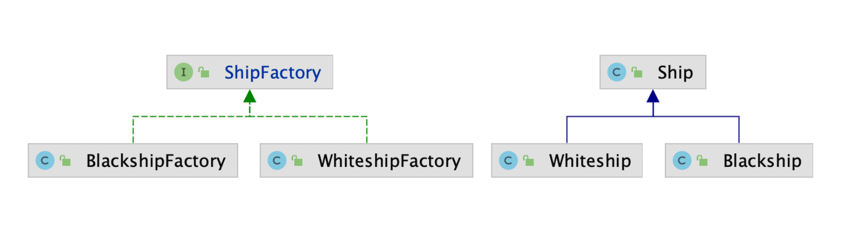

# 팩토리 메소드(Factory method) 패턴

```
구체적으로 어떤 인스턴스를 만들지는 서브 클래스가 정한다.
```
다양한 구현체 (Product)가 있고, 그중에서 특정한 구현체를 만들 수 있는 다양한 팩토리
(Creator)를 제공할 수 있다.



## 팩토리 메소드 구현방법.
```
확장에는 열려있고 변경에는 닫혀있는 구조로 만들보자.

[개방 폐쇄 원칙 (Open Close Principle)]
```

Ship을 생산하는 공장이 있다고 가정해보자. Ship 공장에서는 Whiteship을 생산하고 있다.
그러나 새로운 고객의 요구로 Blackship 도 생산을 해야한다. 이 요구사항을 OCP를 만족하면서 작성
하기 위해 팩토리 메소드 패턴을 사용하여 구현할 수 있다.

아래 클래스 다이어그램을 보면 기존 ShipFactory를 interface 를 BlacshipFactory와 WhiteshipFacotry가 상속받아
각각 서로 다른 요구사항에 맞게 코드를 확장하여 Whiteship과 Blackship을 생성할 수 있는 것을
알 수 있다.




### 변경전 코드

> Ship 객체를 정의하는 클래스이다. name, color, logo 를 가지고 있다.
```
// Ship 객체.
public class Ship {

    private String name;

    private String color;

    private String logo;

    public String getName() {
        return name;
    }

    public void setName(String name) {
        this.name = name;
    }

    public String getColor() {
        return color;
    }

    public void setColor(String color) {
        this.color = color;
    }

    public String getLogo() {
        return logo;
    }

    public void setLogo(String logo) {
        this.logo = logo;
    }

    @Override
    public String toString() {
        return "Ship{" +
                "name='" + name + '\'' +
                ", color='" + color + '\'' +
                ", logo='" + logo + '\'' +
                '}';
    }
}
```

> Ship을 생성하는 공장이다. 이름과, 이메일을 받아 전달 받은 값을 검증한 뒤 Ship을 생성한다.
> Ship을 생성하는 코드에서 name에 따라 whiteship, blackship의 로고와 코드를 정해주는 것을 볼수 있는데
> 새로운 컬러의 ship이 추가된다 가정했을 때 ShipFacotry의 코드를 수정해야하는 문제가 있다.
> 이는 확장에는 열려있고 변경에는 닫혀있는 OCP 원칙을 위반한다.
```
// ship 생성 공장.
public class ShipFactory {

    public static Ship orderShip(String name, String email) {
        // validate
        if (name == null || name.isBlank()) {
            throw new IllegalArgumentException("배 이름을 지어주세요.");
        }
        if (email == null || email.isBlank()) {
            throw new IllegalArgumentException("연락처를 남겨주세요.");
        }

        prepareFor(name);

        Ship ship = new Ship();
        ship.setName(name);

        // Customizing for specific name
        if (name.equalsIgnoreCase("whiteship")) {
            ship.setLogo("\uD83D\uDEE5️");
        } else if (name.equalsIgnoreCase("blackship")) {
            ship.setLogo("⚓");
        }

        // coloring
        if (name.equalsIgnoreCase("whiteship")) {
            ship.setColor("whiteship");
        } else if (name.equalsIgnoreCase("blackship")) {
            ship.setColor("black");
        }

        // notify
        sendEmailTo(email, ship);

        return ship;
    }

    private static void prepareFor(String name) {
        System.out.println(name + " 만들 준비 중");
    }

    private static void sendEmailTo(String email, Ship ship) {
        System.out.println(ship.getName() + " 다 만들었습니다.");
    }

}
```

> 클라이언트에게 whiteshipe, blackship을 제공해주는 코드.
```
// 클라이언트.
public class Client {

    public static void main(String[] args) {
        Ship whiteship = ShipFactory.orderShip("Whiteship", "keesun@mail.com");
        System.out.println(whiteship);

        Ship blackship = ShipFactory.orderShip("Blackship", "keesun@mail.com");
        System.out.println(blackship);
    }

}
```

### 팩토리 메소드 패턴으로 변경된 코드

> Ship을 상속 받는 blackship, whiteship 클래스. 
```
// backship
public class Blackship extends Ship {

    public Blackship() {
        setName("blackship");
        setColor("black");
        setLogo("⚓");
    }
}

// whitship
public class Whiteship extends Ship {

    public Whiteship() {
        setName("whiteship");
        setLogo("\uD83D\uDEE5️");
        setColor("white");
    }
}

```

> interface화 된 ShipFactory 클래스
```

public interface ShipFactory {
    // default method 를 통해 배를 주문 받는 로직을 구현.
    default Ship orderShip(String name, String email) {
        validate(name, email);
        prepareFor(name);
        Ship ship = createShip();
        sendEmailTo(email, ship);
        return ship;
    }

    void sendEmailTo(String email, Ship ship);
    
    // ship 을 생성하는 추상 메소드
    Ship createShip();
    
    // 이름, 이메일을 검증하는 validate 메소드
    private void validate(String name, String email) {
        if (name == null || name.isBlank()) {
            throw new IllegalArgumentException("배 이름을 지어주세요.");
        }
        if (email == null || email.isBlank()) {
            throw new IllegalArgumentException("연락처를 남겨주세요.");
        }
    }
    
    private void prepareFor(String name) {
        System.out.println(name + " 만들 준비 중");
    }

}
```

> ShipFactory를 상속받는 DefaultShipFactory 클래스.
> 이메일을 보내는 추상 메소드를 구현하고 있다.
```
public abstract class DefaultShipFactory implements ShipFactory {

    @Override
    public void sendEmailTo(String email, Ship ship) {
        System.out.println(ship.getName() + " 다 만들었습니다.");
    }

}
```

> DefaultShipFactory 를 상속받은 BlackshipFactory, WhiteshipFactory 클래스
> 새로운 요구사항에 맞게 정의된 객체를 생성하는 creatShip() 메소드를 구현한다.
```
// blackship Factory
public class BlackshipFactory extends DefaultShipFactory {
    @Override
    public Ship createShip() {
        return new Blackship();
    }
}

// whiteshipFactory
public class WhiteshipFactory extends DefaultShipFactory {

    @Override
    public Ship createShip() {
        return new Whiteship();
    }
}
```

> 고객에게 blackship, whiteship을 생성 후 제공해주는 코드
> 
> print() 함수를 보면 인수로 넘겨받은 shipFactory를 통해 name, email 추가하여
> ship을 생성하고 있다.
> 
> main() 함수에서 print() 함수에 shipFactory 인자를 넘길 때 WhiteshipFactory, BlackshipFactory를
> 넘겨준다. 
> 
> 최종적으로 println() 함수를 통해 프린트 되는 함수를 보면 whiteship, blackship이 출력된다.
> 
```
public class Client {

    public static void main(String[] args) {
        Client client = new Client();
        client.print(new WhiteshipFactory(), "whiteship", "keesun@mail.com");
        client.print(new BlackshipFactory(), "blackship", "keesun@mail.com");
    }

    private void print(ShipFactory shipFactory, String name, String email) {
        System.out.println(shipFactory.orderShip(name, email));
    }

}
```

# 정리.

##1.  팩토리 메소드의 장점, 단점

### 장점

기존 객체의 코드를 수정하지 않고 동일한 류의 확장된 기능을 가진 새로운 객체로 확장할 수 있다.
팩토리 메소드에서 이와 같이 확장에 열려있고 변경에 닫혀있는 객체를 생성할 수 있는 이유는 
프로덕트와 크리에이터(여기서는 factory) 간의 커플링을 느슨하게 가져가기 때문이다. (느슨한 결합)


### 단점
새로운 프로덕트를 생성 할 때마다, 상속을 받아 또다른 클래스를 작성 해야하므로 클래스의 개수가 계속해서 늘어나게 된다.

--- 

##2. 확장에 열려있고 변경에 닫혀있는 객체 지향 원칙이란?
기존에 구현된 객체가 있을 때 새롭게 요구되는 변경사항이 있다면 기존 객체 코드를 변경 없이
객체를 확장 시킬 수 있어야한다는 객체 지향 원칙이다.


---

##3. 자바 8에 추가된 default 메소드에 대해 설명하세요.
interface 는 기능에 대한 정의만 선언 가능하기 때문에 기능을 구현한 메소드를 포함할 수 없다.
그러나 자바 8에서 default 메소드가 추가되면서 interface 에서도 기능을 구현한 메소드를 선언할 수 있게 되었다.
(default 키워드를 메소드에 명시 해야만 default 메소드이다. 접근제어자에서 사용되는 default 와 같은 키워드 이지만 접근제어자에서는 default 키워드를 명시하지 않으니 헷갈리지 않도록 주의해야한다.)

### default 메소드를 사용하는 이유는?

- 하위 호완성을 보완하기 위해서 사용한다,

기존에 존재하던 인터페이스를 이용하던 클래스에서 추가적으로 인터페이스를 변경해 사용해야 하는 경우
또는 필수적으로 존재해야하는 메소드가 있을 경우 이미 이 인터페이스를 구현한 클래스와는
호환성이 떨어지게 된다. 이경우 default 메소드를 사용할 경우 하위 호환성은 유지되면서
인터페이스의 보완을 진행할 수 있게 된다.


