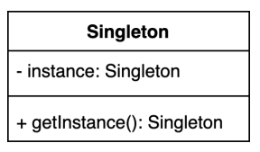

# 싱글톤 패턴

```
인스턴스를 오직 하나만 제공하는 클래스. 
```


### 🏷️싱글톤 패턴이 사용 되어야하는 이유

시스템 런타임, 환경 세팅 정보 등 인스턴스가 여러개일 경우 문제가 발생할 여지가 있는 경우가 있다.
이때 인스턴스를 오직 하나만 만들어 제공하는 클래스가 필요하다.



(그림 1) 싱글톤 클래스에 필요한 인자, 함수.
 


| 명칭                        | 유형       | 설명                                                              |
|:--------------------------|:---------|:----------------------------------------------------------------|
| instance: Singleton       | 인스턴스     | 하나만 존재해야하는 인스턴스 객체                                              |
| getInstance(): Singleton  | 함수       | 싱글톤을 반환 받을때 사용하는 함수, 오직 하나의 인스턴스만 반환한다.                         |

## [01] 싱글톤 구현 방법 1

---

### private 생성자에 static 메소드.
#### 가장 간단한 싱글톤 패턴을 구현하는 방법.

```
public class SimpleSingleton {

    private static SimpleSingleton instance;

    // * 외부에서 해각 인스턴스를 new 를 통해 생성하지 못하기 위해, 생성자를 private 으로 만든다.
    private SimpleSingleton() {}

    // * 인스턴스를 반환하받을 수 있는 함수.
    public static SimpleSingleton getInstance() {
        if (instance == null) {
            instance = new SimpleSingleton();
        }

        return instance;
    }

}
```

위 방법에서의 문제점으로는 getInstance()가 멀티쓰레드 환경에서 안전하지 않는 방식이다. 
그 이유는 당죽 멀티 쓰레드가 실행 되면서 동시에 각각 새로운 인스턴스를 생성할 수 있기 때문이다.


## 싱글톤 구현 방법 2

---

#### synchronized 키워들들 추가하여 메소드 단위로 동기화를 적용하여 멀티쓰레드 환경에서 안전하게 만드는 방법.

```

/**
 * 싱글톤 패턴 구현 방법 02
 *  동기화(synchronized)를 사용해 멀티쓰레드 환경에 안전하게 만드는 방법
 * (2022-09-05 AM 12:19)
 */
public class SimpleSingleton02 {

    private static SimpleSingleton02 instance;

    // * 외부에서 해각 인스턴스를 new 를 통해 생성하지 못하기 위해, 생성자를 private 으로 만든다.
    private SimpleSingleton02() {}

    // * 인스턴스를 반환하받을 수 있는 함수.
    public static synchronized SimpleSingleton02 getInstance() {
        if (instance == null) {
            instance = new SimpleSingleton02();
        }

        return instance;
    }

}

```

자바에서 synchronized 키워드를 사용할 경우 해당 메서드에 하나의 쓰레드만 사용이 가능하고, (Lock을 통해 제어)  
이후 다른 쓰레드는 사용중인 쓰레드의 작업이 마무리 될 때 까지 기다리게 된다. 그로 인해 성능에 불이익이 있을 수 있다.

쓰레드 A -> 메소드 사용 (LOCK)  -> 사용완료 LOCK 해제
쓰레드 B -> (LOCK) 으로 인해 사용 대기 -> 해당 메소드 사용.

static getInstance() 메소드 동기화시 사용하는 락(lOCK)은 해당 클래스 단위로 락이 발생 된다. 스태틱 메소드를 동기화 하는 방식은 이 메소드르 가진 클래스 기준으로 이루어 진다.
jvm 안에 클래스 객체는 클래스 당 하나만 존재할 수 있으므로 같은 클래스에 대해서는 오직 한 쓰레드만 동기화된 스태틱 메소드를 실행할 수 있다.


---
## Singleton 패턴 구현 방법 3
#### 이른 초기화 (early initialization)을 사용하는 방법

static 으로 생성된 변수에 싱글톤 객체를 선언했기 때문에 클래스 로더에 의해 클래스가 로딩될 때 
싱글톤 객체가 생성된다. 또 클래스 로더에 의해 클래슥 최초 로딩 될 떄 객체가 생성되므로 Thread-safe 한 방식이다.
단 단점으로는 싱글톤 객체의 사용 유무와 상관없이 클래스가 로딩 되는 시점에서 항상 싱글톤 객체가 생성되고, 메모리를 잡고 있기 때문에 비효율적일 수 있다.

이른 초기화 방식은 항상 싱글톤 객체가 필요하거나 객체 생성 비용이 크게 들어나지 않는 경우 사용할때 유용하다.

```
public class Settings {
    private static final Settings INSTANCE = new Settings();
    
    private Settings() {}
    
    public static Settings getInstnace() {
        return INSTANCE;
    }

}
```

## singleton 패턴 구현 방법 4

---
#### double checked locking 으로 효율적인 동기화 블럭 만들기

instance 객체 생성 여부를 체크할 때 null 일경우 synchronized 블록에서 또한번 검증하도록 하는 방식이다.
만약 instance 객체가 생성되지 않았을 경우, synchronized 블록에 의해 locking이 되므로 첫 번째 쓰레드만 instance를 생성하게 되고
그 이후 진입한 쓰레드들은 대기상태가 된다. instance 생성 여부를 두번 검증하기 때문에 double-checked locking 이라한다.

장점으로는 getInstance() 함수 자체에 synchronized 시키는 것보다 성능적으로 우수하며, 필요할 때만 instnace 객체를 생성할 수 있어 효율적이다.

인스턴스 변수를 정의할 때 volatile 를 추가해줘야만 동기화가 된다. 

```
public static Settings {
    
    private static volatile Settings instance;
    
    private Settings() {}
    
    public static Settings getInstance() {
        if (instance == null) {
            // 이중 체크.
            synchronzied (Settings.class) {
                if (instance == null) { 
                    instance == new Settings();
                }   
            }
        }
    }    
    
}
```


## singleton 패턴 구현 방법 5

---
#### static inner 클래스 사용하기

싱글톤 패턴 구현 시 권장하는 방법 중 하나다. 싱글톤 객체를 생성할 클래스 내부에 static inner 클래스를 사용하여 getInstance()를 호출 하는 시점에
SettingHolder 를 통해 인스턴스를 받아오는 방식이다. 

Settings.getInstance() 함수를 실행하는 시점(최초로 내부 클래스가 사용하는 시점)에 JVM에 SettingHolder 가 로드되기 때문에 지연 초기화(lazy initialization)이라 볼 수 있다.
그러므로 INSTANCE 변수에 static final 을 사용하였다고 하더라도, SettingHolder 가 최초로 사용되는 시점에 초기화가 된다. 
이른 초기화(early initialization) 방법과 달리 불필요하게 메모리를 차지 할 필요가 없어지게 된다. 


```
public static Settings {
    
    private static volatile Settings instance;
    
    private Settings() {}
    
    private static class SettingHolder {
        private static final Settings INSTANCE = new Settings();
    }
    
    public static Settings getInstance() {
      return Settings.INSTANCE;
    }    
    
}
```

#### singleton 패턴 구현을 깨트리는 방법 1.

---
#### 리플렉션 사용

리플렉션이란 구체적인 클래스를 알지 못하더라도 그 클래스의 변수, 메소드, 타입에 접근 할 수 있도록 해주는 자바 API

#### 리플렉션을 사용하는 경우
- 동적으로 클래스를 사용해야 할때 필요하다.
- (작성할 시점에는 어떤 클래스를 사용해야 할지 모르는 런타임시점에 클래스를 가져와 사용해야 하는 경우.)
- 대표적으로는 Spring boot 애노테이션을 기능이 `리플렉션`을 사용하여 구현되었음.

#### setAccessible(boolean) 함수란?
- 필드나 메서드의 접근 제어 지시자에 의한 제어를 변경하는 함수이다.
- private 의 경우 일반적으로 외부에서 접근이 불가능하나 setAccessible() 을 사용하면 접근 가능하다.
- 단 setAccessible()을 사용하더라도 접근 연산자(.)를 이용하는 방식은 불가능하다. 

이와 같이 리플렉션을 통해 private 필드를 접근하여 인스턴스를 생성할 경우 singleton 패턴이 깨지게 된다. 

```
Settings settings = Settings.getInstance();

// 리플렉션을 확용하여 생성자를 직접
Constructor<Settings> declaredConstructor = Settings.class.getDeclaredConstructor();
declaredConstructor.setAccessible(true);
Settings settings1 = declaredConstructor.newInstance();

System.out.println(settings == settings1);
```


## singleton 패턴 구현을 깨트리는 방법 2

---
#### 직렬화 & 역직렬화를 사용

#### 자바 직렬화 & 역직렬화란?
객체를 직렬화하기 위해 연속적인 객체들의 데이터를 연속적인 byte나 String으로 변환하는 과정을 말한다.
즉, 직렬화는 객체를 파일 형태등 형태로 저장하거나, 통신하기 쉬운 포맷으로 변환하는 과정을 의미한다.
일반적으로 byte로 변환하지만 json, xml, csv 등으로도 변환 가능하다. 역직렬화를 통해 직렬화 된 데이터를 원래 객체 구조로 복구 시킬 수 있다.
자바에서는 `Serializable 인터페이스`를 통해 직렬화/역직렬화를 하는 기능을 제공한다.   


자바 객체에 implements Serializable 구현
```
public static Settings implements Serializable {
    
    private static volatile Settings instance;
    
    private Settings() {}
    
    private static class SettingHolder {
        private static final Settings INSTANCE = new Settings();
    }
    
    public static Settings getInstance() {
      return Settings.INSTANCE;
    }    
    
}
```


직렬화/역직렬화로 자바 객체 저장/불러 올 경우.
```
public static void main() {
    Settings settings = Settings.getInstance(); 
    Settings settings1 = null;
     
     // outputStream 으로 settings.obj 를 파일로 저장.
    try (ObjectOutput out = new ObjectOutputStream(new FileOutputStream("settings.obj"))) { 
     out.writeObject(settings); 
    }
     
     // outputStream 으로 settings.obj 를 파일로 일기
    try (ObjectInput in = new ObjectInputStream(new FileInputStream("settings.obj"))) { 
     settings1 = (Settings) in.readObject(); 
    } 
    
    // settings1 과 settings는 불일치 한 결과를 반환함.
    System.out.println(settings == settings1);
}
```

자바 직렬화/역직렬화에서 안전하도록 대응하는 방법은 Serializable 클래스에서 내부적으로 사용하는 readResolve() 함수를 오버라이딩하여 생성된 getInstance() 함수를 통해 객체를 반환하는
방법 있다.

```
    protected Object readResolve() {    
        return getInstance();
    }
```

그러나 이방법을 통해서는 리플랙션까지 방지 할 수 없다.


## 싱글톤 (Singleton) 패턴 구현 방법
---
### enum을 사용하는 방법.

enum 은 내부적으로 Enum 클래스를 상속받고 있고 Enum 클래스는 자체적으로 Serializable 가 구현되어있다.
자바에서 지원하는 리플랙션에서는 Enum 자체를 리플렉션 할 수 없도록 구현되어 있어 리플랙션에 안전하고, 
직렬화/역직렬화를 하더라도 동일한 객체로 인식한다.

enum 의 단점
- 컴파일 시점에 미리 생성된다. 
- enum 을 제외한 클래스는 상속을 받을 수 가 없다. 

enum 클래스
```
public enum Settings {
    INSTANCE;
}
```


# 정리.

싱글톤 패턴을 구현하는 방법은 여러가지 있다 간단하게 사용할 수 있는 private 생성자외 static 메서드를 활용한 방법과 enum 을 활용한 방법, static inner 클래스를 사용한 방법이 있다.

그러니 private 생성자와 static 메서드를 활용한 방법은 멀티 쓰레드 환경에서는 안전하지 않기 때문에 이른 초기화를 사용하거나 synchronzied 를 활용하여 검증하는 방식이 있다.

이른 초기화는 초기화 시점에 static 으로 생성 되어 있기 때문에 사용 시점이 아닌 경우에도 불필요하게 메모리를 차지하여 비효율 적인 면이있다. 이른 초기화는 항상 싱글톤으로 필요하거나 객체 생성 비용이 크지 않는 경우에만 사용하는 것이 좋다. 

synchronized 방식의 경우 검증시 마다 해당 클래스가 locking 되어 검증하기 때문에 불필요한 리소스가 발생하여 double checked locking 방법으로 개선 할 수도 있다.

현재 멀티 쓰레드 환경에서 안전한 방식으로는 enum을 활용하거나 static inner 클래스를 사용하는 것을 권장한다.

static inner class 사용하는 경우 쓰레드풀하게 싱글톤 구현이 가능하다. 직렬화/역직렬화의 경우에는 Serializable 을 상속 받아 readResolve() 함수를 오버라이딩하여 방지할 수 있으나 리플랙션은 방지할 수 있는 방법이 없다.

enum 을 활용 할 경우 자바의 리플랙션, serializable 를 활용한 방법 모두 안전을 보장한다. 리플랙션의 경우에는 자바 자체에서 enum을 사용할 수 없도록 제한이 되어있고 직렬화/역직렬화 역시 동일한 값으로 인식되기 때문에  문제가 발생하지 않는다. 다만 단점으로는 컴파일 단계에서 미리 초기화가 되기 때문에 비효율적인 면이 있고 Enum 클래스를 제외한 다른 클래스는 상속을 받지 못하기 때문에 상속을 사용해야 하는 경우에는 static inner class 를 활용 해야 한다.

